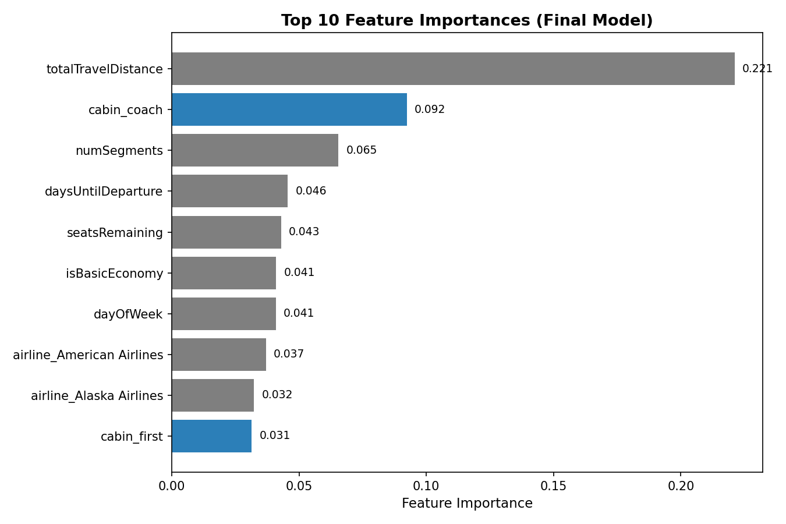

# Dynamic Airline Ticket Pricing Engine

A machine learning pricing engine that predicts airfare based on route, cabin class,
booking lead time, and demand signals -- deployed as a serverless AWS pipeline.

Trained on ~95,000 real Expedia-scraped flight itineraries. Deployed via Docker
container images on AWS Lambda, with predictions stored in DynamoDB. Manually
invoked and verified end-to-end; nightly EventBridge automation was deliberately
not enabled (see "Known limitations" below).

## Results


- **Mean Absolute Error: $46.66** (~12.4% of average fare) on a held-out test
  set of 18,992 real historical flights the model never saw during training.
- Feature engineering was validated experimentally, not assumed -- e.g. testing
  showed combining `airline` + `numSegments` outperformed either alone
  ($51.93 vs. $53.15 vs. $62.33 MAE), while adding a combined `route` feature
  added 250+ columns for effectively zero accuracy gain and was rejected.
- Deployment integrity was independently verified: the exact model + feature
  pipeline running in AWS Lambda was confirmed to reproduce the $46.66
  training-time MAE against real historical data, and to produce identical
  output to the same code run locally.
- Real-world spot-check against live August 2026 fares (Google/airline direct
  pricing) showed strong accuracy on some routes (within $2 of real JetBlue
  fares) and revealed a known limitation: absolute price levels reflect 2022
  training data and underpredict on some routes relative to 2026 fares,
  consistent with airfare inflation the model was never trained to account for.


*The cabin_coach and cabin_first features (highlighted) were added after error
analysis on the worst-performing predictions revealed the model had no way to
distinguish premium-cabin fares from coach — see "Results" above.*
## Reproduce these results

Clone this repo, install dependencies, then run:

```bash
pip install -r requirements.txt
python train_model.py
```

This trains on `clean_flight_data.csv` (included in this repo) and should
print `Mean Absolute Error: $46.66` on the held-out test set.

## Proof of deployment


## Architecture

```
Historical flight data (CSV)
        |
        v
  Pandas cleaning + feature engineering
  (booking lead time, day-of-week/month, route, cabin, num segments)
        |
        v
  RandomForestRegressor (scikit-learn)
        |
        v
  Model artifact -> Amazon S3
        |
        v
  AWS Lambda (Docker container image)
  - Downloads model from S3
  - Generates predictions for upcoming 30 days
        |
        v
  Amazon DynamoDB (predicted prices, keyed by route + date)
```

Currently triggered manually via the Lambda console. Nightly automation via
Amazon EventBridge was designed but intentionally not enabled -- see below.

## Tech stack

- **ML**: Python, Pandas, scikit-learn (RandomForestRegressor)
- **Deployment**: Docker, AWS Lambda (container images), Amazon ECR
- **Storage**: Amazon S3 (model artifacts), Amazon DynamoDB (predictions)
- **IAM**: least-privilege access policies scoped per service

## Project structure

```
clean.py                       # Data cleaning + feature engineering
train_model.py                 # Train/evaluate RandomForestRegressor
03_validate_deployment.py      # Verifies deployed model matches training MAE,
                                # and Lambda output matches local output
lambda_function.py             # Lambda handler: predict + write to DynamoDB
Dockerfile                     # Lambda container image definition
requirements.txt               # Python dependencies
```

## Known limitations

- Training data spans a narrow ~10-day search window (April 2022), limiting
  the model's ability to learn true seasonal pricing patterns.
- `seatsRemaining` (the booking-velocity signal) is simulated at prediction
  time using a fixed assumed value, since no live booking feed is connected --
  this is a static demo pipeline, not connected to real-time inventory.
- Absolute price levels reflect the training data's 2022 pricing era and would
  need retraining on recent data to track current airfare levels.
- **Nightly EventBridge automation was deliberately not enabled.** The
  pipeline currently regenerates predictions for a fixed set of 8 hardcoded
  routes using static assumed features -- running it nightly would just
  recompute the same values with no new information, since no live data
  source feeds in. Automation is a clearly-scoped next step once a live
  pricing API (see below) is integrated to feed real, changing inputs.

## What I'd build next

- Integrate a live flight-pricing API (e.g. Travelpayouts) to replace
  historical-data simulation with real, current demand signals.
- Expand beyond the current 8 hardcoded routes to the full route set the
  model was trained on.
- Retrain periodically on rolling recent data to keep pace with pricing trends.
